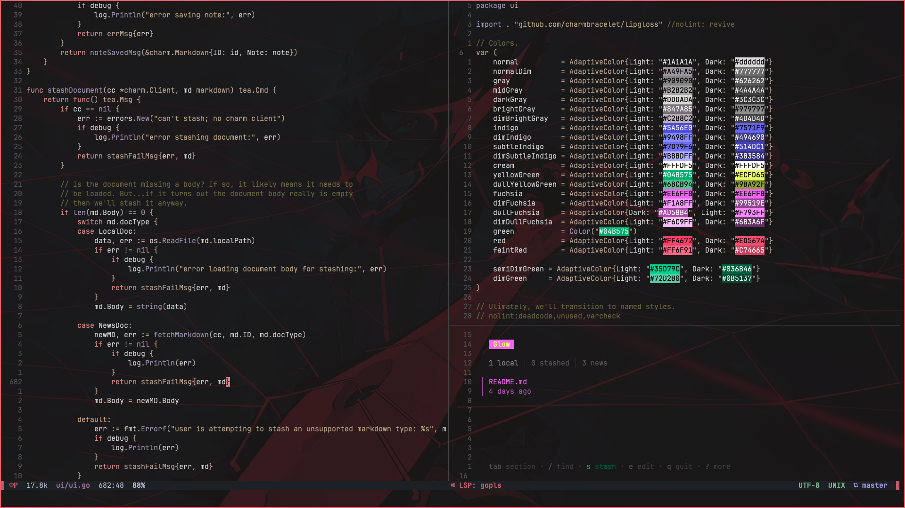
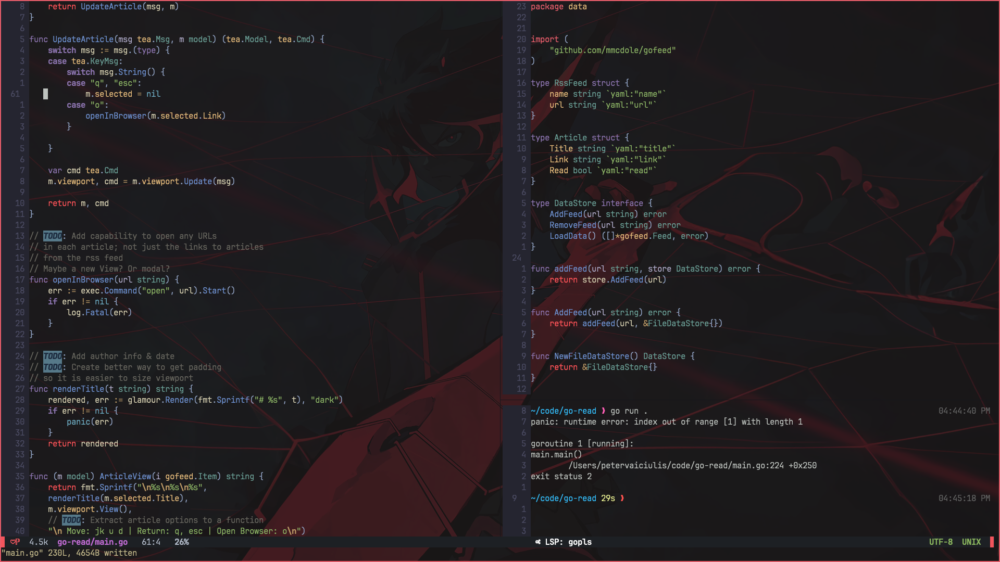
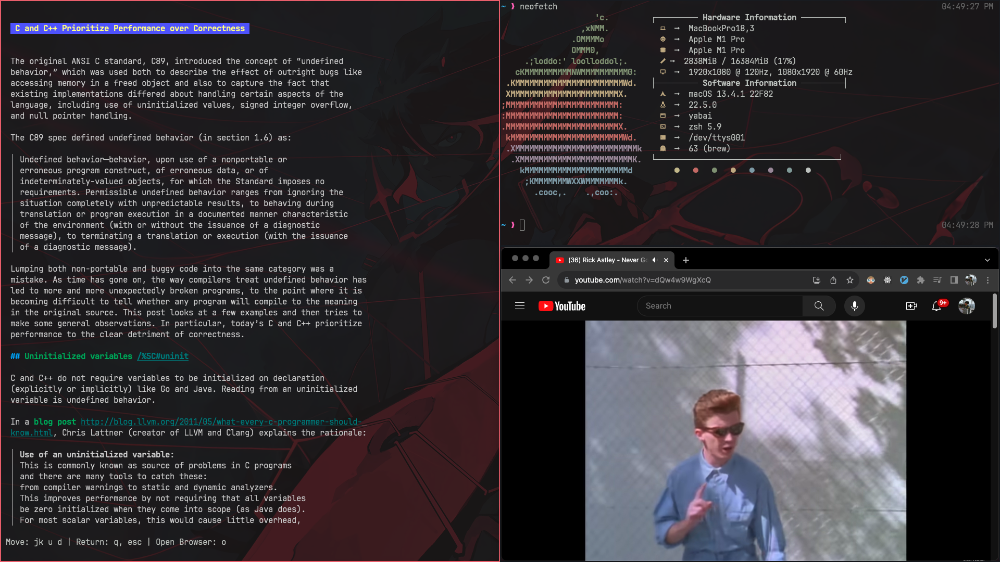

# ~.dotfiles/
Welcome to my dotfiles repository.


## Background
The other day I accidentally broke my MBP (broke login).
Fortunately, I was able to do a full reset and regain access,
but the process of getting everything back to where I had it took more time than I would have liked.
Therefore, I have decided it is time to start managing my dotfiles more efficiently.

After doing some [reading](https://alexpearce.me/2016/02/managing-dotfiles-with-stow/),
I settled on a basic setup using `stow` and `git`.

## Software
Included in my dotfiles are configurations for the following:
* alacritty
* yabai
* skhd
* nvim

Along with some others that have snuck in here.

``` bash
.
├── .config
│   ├── alacritty
│   │   └── alacritty.yml
│   ├── fish
│   │   ├── completions
│   │   ├── conf.d
│   │   ├── config.fish
│   │   ├── fish_variables
│   │   └── functions
│   ├── gh
│   │   ├── config.yml
│   │   └── hosts.yml
│   ├── github-copilot
│   │   └── versions.json
│   ├── kitty
│   │   └── kitty.conf
│   ├── nvim
│   │   ├── after
│   │   │   └── plugin
│   │   │       ├── colors.lua
│   │   │       ├── fugitive.lua
│   │   │       ├── lsp.lua
│   │   │       ├── lualine.lua
│   │   │       ├── refactoring.lua
│   │   │       ├── remaps.lua
│   │   │       ├── telescope.lua
│   │   │       ├── treesitter.lua
│   │   │       └── undotree.lua
│   │   ├── init.lua
│   │   ├── lua
│   │   │   └── p5quared
│   │   │       ├── init.lua
│   │   │       ├── packer.lua
│   │   │       └── set.lua
│   │   └── plugin
│   │       └── packer_compiled.lua
│   ├── skhd
│   │   └── skhdrc
│   └── yabai
│       └── yabairc
├── .zshrc
└── README.md
```


